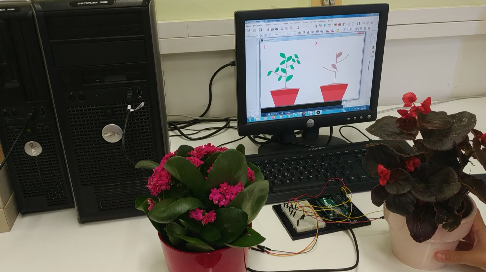

# smart-plants
Έργο για το διαγωνισμό ρομποτικής

**«Διψάω» ή «Είμαι εντάξει»**

Το πράσινο στις πόλεις συμβάλει στην αντιμετώπιση της κλιματικής αλλαγής. Εφοδιάζει την ατμόσφαιρα με οξυγόνο και μειώνει τη θερμοκρασία.
Οι εφαρμογές που υπάρχουν για την περιποίηση φυτών ειδοποιούν ότι τα φυτά χρειάζονται πότισμα  με βάση έναν αρχικό προγραμματισμό.
Στο έργο μας τα φυτά ειδοποιούν όταν χρειάζονται νερό. Αν είναι ποτισμένα η εφαρμογή μας εμφανίζει εικόνες υγιών φυτών ενώ για αυτά που χρειάζονται νερό εμφανίζονται εικόνες φυτών που έχουν ξεραθεί, παρακινώντας για το πότισμά τους.

Χρησιμοποιούμε δύο φυτά, με έναν αισθητήρα υγρασίας εδάφους για το καθένα. Οι αισθητήρες συνδέονται με ένα Arduino. Η εφαρμογή διαβάζει τις τιμές των αισθητήρων και ανάλογα, για κάθε τιμή εμφανίζει την εικόνα ενός πράσινου ή ξερού φυτού.

Με το λογισμικό Tinkercad στο διαδίκτυο δημιουργήσαμε τον κώδικα για το arduino, σε περιβάλλον οπτικού πριγραμματισμού. Επιλέον, δημιουργήσαμε μια εφαρμογή στο processing που διαβάζει τις τιμές της υγρασίας που στέλνει η εφαρμογή του arduino  και στη συνέχεια εμφανίζει, ανάλογα, εικόνες ξερών ή πράσινων φυτών.

Η σύνδεση arduino υπολογιστή γίνεται με καλώδιο usb για λόγους απλότητας. Σε ένα ρεαλιστικό παράδειγμα θα είχαμε σύνδεση WiFi. Επίσης, οι μαθητές συμμετείχαν στη δημιουργία του αλγορίθμου για την εφαρμογή στο processing.

 Το έργο δημιουργήθηκε από μαθητές της τάξης ΣΤ΄, για τη συμμετοχή μας στον Πανελλήνιο διαγωνισμό ανοιχτών τεχνολογιών στην εκπαίδευση.
 
 Χρειαστήκαμε:
 
    1.  Arduino Uno
    
    2.  2 αισθητήρες μέτρησης υγρασίας εδάφους
    
    3.  breadboard
    
    4.  καλώδια
    
Το κόστος των υλικών ήταν 35,3 ευρώ (22,9+2*3,5+3,2+2,2).

Η εργασία ξεκίνησε πέρυσι με ομάδα μαθητών της έκτης τάξης αλλά δεν υπήρξε αρκετός χρόνος για να ολοκληρωθεί χωρίς την φυσική παρουσία των παιδιών στο σχολείο.

Μαθητές που συμμετείχαν φέτος: Ζαφείρης Λιαλιάρης, Παναγιώτης Τσακίρης

Υπεύθυνη εκπαιδευτικός: Θεοδώρα Θεοδωρίδου

